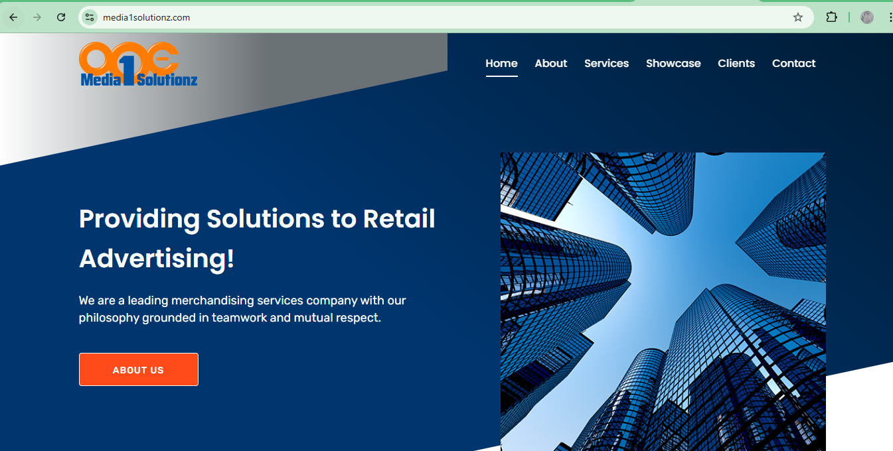
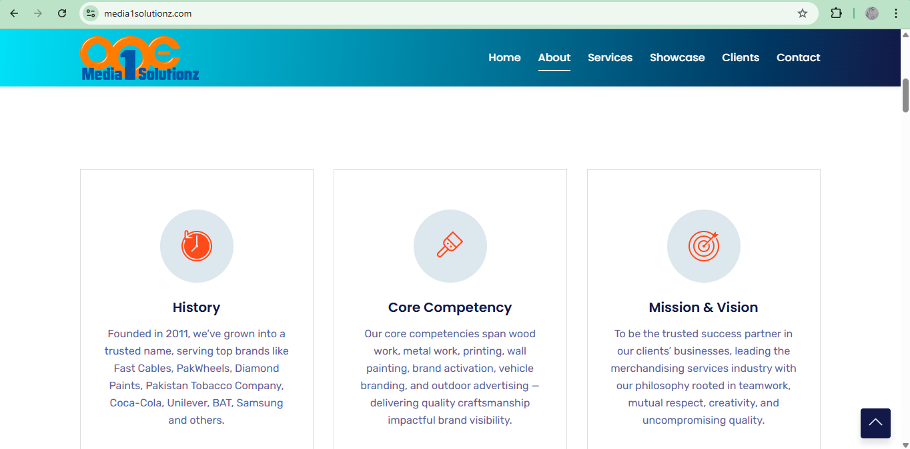
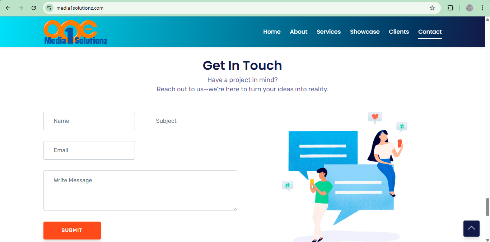
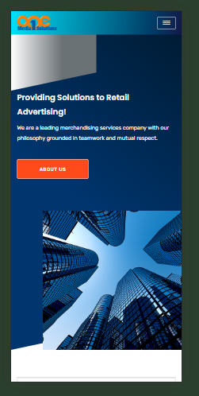

Media1Solutionz – Company Website
Description:
Media1Solutionz is a fully custom-built company website developed according to specific client requirements. The entire website layout, structure, styling, content placement, and icons were designed and implemented from scratch without using any pre-built templates. All visual assets were manually selected and integrated to match the client’s branding and expectations.

The website is live and fully functional, serving as the official online presence of the client.

Tech Stack
- HTML5  
- CSS3  
- JavaScript  

Key Features
- Fully custom UI
- Responsive design for desktop and mobile devices
- Functional contact form with email submission
- Clean and structured layout
- Custom icons and manually integrated visual assets
- Client-focused design and content alignment

Contact Form Functionality
The website includes a fully working **Contact Us** form that:
- Collects user input
- Submits form data directly to the client’s email
- Ensures smooth user interaction and proper validation

Screenshots

Live Demo
**Live Website:**[ [media1solutionz.com](https://www.media1solutionz.com/)]

Project Highlights
- Built completely from scratch based on client specifications
- No external templates or UI kits used
- All content, layout, icons, and images were manually handled
- Focused on usability, clarity, and professional appearance
